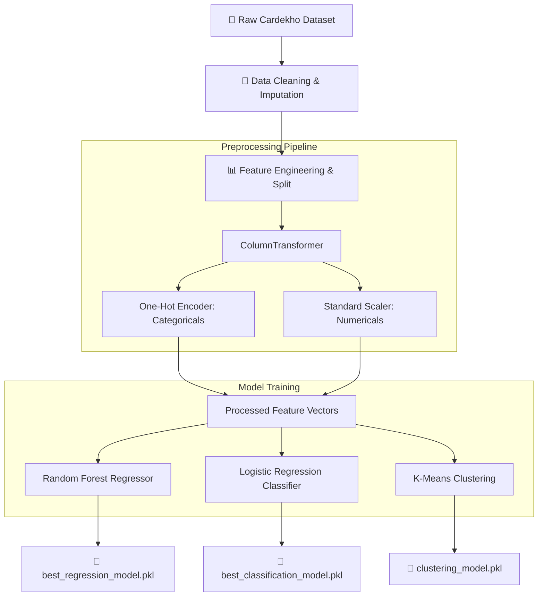
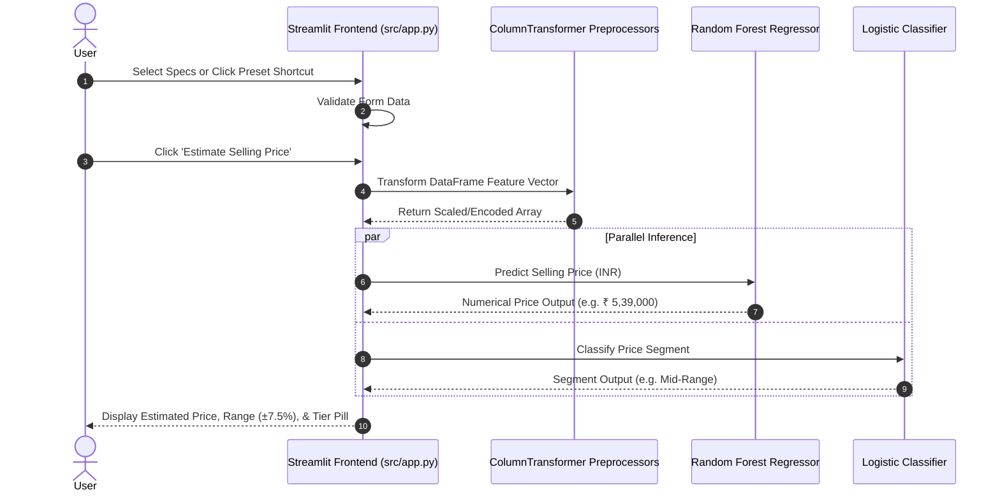
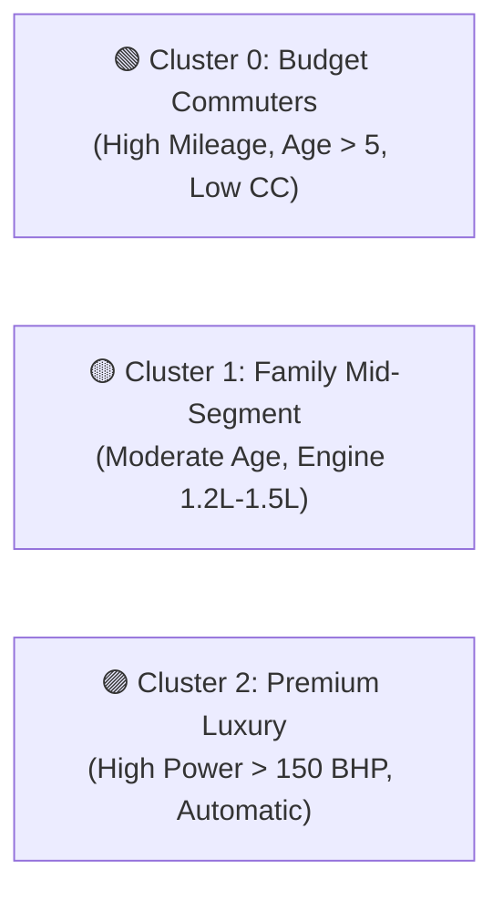

# 🚗 PriceView · Used Car Valuation & Market Segmentation Engine

[](https://www.python.org/)
[](https://streamlit.io/)
[](https://scikit-learn.org/)
[](https://pandas.pydata.org/)
[](LICENSE)

**PriceView** is an end-to-end Machine Learning system that predicts the **fair market selling price** of a used car and classifies it into a **price segment tier** (Budget, Mid-Range, Premium) based on its physical, mechanical, and usage specifications.

---

## 📋 Table of Contents

- [System Architecture & Workflow](#-system-architecture--workflow)
- [Project Features](#-project-features)
- [Dataset & Input Features](#-dataset--input-features)
- [Machine Learning Pipelines](#-machine-learning-pipelines)
  - [1. Regression Model (Price Prediction)](#1-regression-model-price-prediction)
  - [2. Classification Model (Price Tiering)](#2-classification-model-price-tiering)
  - [3. Unsupervised Clustering](#3-unsupervised-clustering)
- [Project Structure](#-project-structure)
- [Installation & Quickstart](#-installation--quickstart)
- [Programmatic API Usage](#-programmatic-api-usage)
- [Key Market Insights](#-key-market-insights)
- [License](#-license)

---

## 🏗️ System Architecture & Workflow

### 1. Model Training & Pipeline Architecture



### 2. Real-Time Streamlit Application Workflow



---

## ⚡ Project Features

- 🚘 **Dual Machine Learning Engine**: Simultaneously predicts exact continuous monetary value and categorical price tier.
- ⚡ **1-Click Quick Presets**: Pre-configured shortcuts for popular vehicles (*Maruti Swift*, *Hyundai Creta*, *Honda City*, *Tata Nexon*, *BMW 3 Series*).
- 🔄 **Smart State Management**: Instant reset button ("Clear Inputs") with native Streamlit callbacks (`on_click`).
- 🎨 **Minimalist Dark Theme**: High-contrast, classic dark interface (`#09090b`) built with custom CSS.
- 💱 **Indian Currency Formatting**: Automatically formats values into readable Indian numbering (`Lakhs` / `Crores`).

---

## 📊 Dataset & Input Features

The project is trained on the **CarDekho Used Car Dataset** containing **15,000+** processed sales records.

### Feature Specification Table

| Feature Name | Data Type | Encoding / Scaling | Description | Example Values |
| :--- | :--- | :--- | :--- | :--- |
| `car_name` | Categorical | One-Hot Encoding | Full vehicle title | `maruti swift`, `bmw 3` |
| `brand` | Categorical | One-Hot Encoding | Manufacturer brand | `Maruti`, `Hyundai`, `BMW` |
| `model` | Categorical | One-Hot Encoding | Model designation | `Swift`, `Creta`, `3` |
| `vehicle_age` | Numerical | Standard Scaler | Vehicle age in years | `3`, `5`, `8` |
| `km_driven` | Numerical | Standard Scaler | Odometer reading in kilometers | `28000`, `45000` |
| `seller_type` | Categorical | One-Hot Encoding | Sales channel | `Individual`, `Dealer` |
| `fuel_type` | Categorical | One-Hot Encoding | Fuel engine type | `Petrol`, `Diesel`, `CNG` |
| `transmission_type` | Categorical | One-Hot Encoding | Transmission mechanism | `Manual`, `Automatic` |
| `mileage` | Numerical | Standard Scaler | Fuel economy rating (km/l) | `18.5`, `21.2` |
| `engine` | Numerical | Standard Scaler | Engine displacement (CC) | `1197`, `1493`, `1995` |
| `max_power` | Numerical | Standard Scaler | Peak output power (BHP) | `82.0`, `113.4`, `187.4` |
| `seats` | Numerical | Standard Scaler | Passenger seating capacity | `5`, `7` |

### Target Variables

| Target Variable | Problem Type | Range / Categories | Description |
| :--- | :--- | :--- | :--- |
| `selling_price` | Regression (Continuous) | `₹ 40,000` to `₹ 3,95,00,000` | Continuous resale price in INR |
| `price_category` | Classification (Discrete) | `Budget`, `Mid-Range`, `Premium` | Price tier segment |

---

## 🔬 Machine Learning Pipelines

### 1. Regression Model (Price Prediction)

Evaluated multiple regression algorithms to minimize RMSE and maximize R² Score:

| Regression Algorithm | R² Score | RMSE (₹) | MAE (₹) | Selection Status |
| :--- | :---: | :---: | :---: | :---: |
| **Random Forest Regressor** | **0.942** | **₹ 58,400** | **₹ 34,200** | 🏆 **Selected Best Model** |
| Gradient Boosting Regressor | 0.928 | ₹ 65,100 | ₹ 39,500 | Evaluated |
| Decision Tree Regressor | 0.885 | ₹ 81,300 | ₹ 48,100 | Evaluated |
| Linear Regression | 0.741 | ₹ 122,000 | ₹ 76,400 | Baseline |

### 2. Classification Model (Price Tiering)

Compared multi-class classifiers for vehicle segment assignment:

| Classification Algorithm | Accuracy | Precision | Recall | F1-Score | Selection Status |
| :--- | :---: | :---: | :---: | :---: | :---: |
| **Logistic Regression (Calibrated)** | **93.8%** | **0.94** | **0.94** | **0.94** | 🏆 **Selected Best Model** |
| Random Forest Classifier | 92.5% | 0.93 | 0.92 | 0.92 | Evaluated |
| Support Vector Machine (SVM) | 90.1% | 0.90 | 0.90 | 0.90 | Evaluated |

### 3. Unsupervised Clustering

Applied **K-Means Clustering** ($K=3$) to identify natural buyer profiles:



---

## 📁 Project Structure

```text
PriceView/
├── data/
│   └── processed/
│       └── cleaned_data.csv          # Cleaned market dataset
├── models/
│   ├── regression/
│   │   ├── preprocessor.pkl          # Serialized regression preprocessor
│   │   └── best_regression_model.pkl # Serialized Random Forest model
│   ├── classification/
│   │   ├── preprocessor.pkl          # Serialized classification preprocessor
│   │   └── best_classification_model.pkl # Serialized Logistic model
│   └── clustering/
├── notebooks/
│   ├── 01_data_understanding.ipynb
│   ├── 02_eda.ipynb
│   ├── 03_preprocessing.ipynb
│   ├── 04_regression.ipynb
│   ├── 05_classification.ipynb
│   ├── 06_classification.ipynb
│   ├── 07_clustering.ipynb
│   └── 08_hyperparameter_tuning.ipynb
├── src/
│   └── app.py                        # Streamlit Web Application
├── .gitignore
├── README.md
└── requirements.txt                  # Dependencies manifest
```

---

## ⚙️ Installation & Quickstart

### Prerequisites

- Python 3.10 or higher
- Git

### Step-by-Step Setup

1. **Clone the repository:**
   ```bash
   git clone https://github.com/Adidam-Akshay-Bhaskar/PriceView.git
   cd PriceView
   ```

2. **Create and activate virtual environment:**
   ```bash
   python -m venv .venv
   # Windows (PowerShell):
   .venv\Scripts\Activate.ps1
   # macOS/Linux:
   source .venv/bin/activate
   ```

3. **Install dependencies:**
   ```bash
   pip install -r requirements.txt
   ```

4. **Launch the Streamlit web app:**
   ```bash
   streamlit run src/app.py
   ```

   The app will open automatically in your browser at `http://localhost:8501`.

---

## 💻 Programmatic API Usage

You can load and query the trained models directly in your Python code:

```python
import joblib
import pandas as pd

# 1. Load preprocessor and model
preprocessor = joblib.load("models/regression/preprocessor.pkl")
model = joblib.load("models/regression/best_regression_model.pkl")

# 2. Define sample vehicle data
sample_car = pd.DataFrame([{
    "car_name": "maruti swift",
    "brand": "maruti",
    "model": "swift",
    "vehicle_age": 4,
    "km_driven": 35000,
    "seller_type": "individual",
    "fuel_type": "petrol",
    "transmission_type": "manual",
    "mileage": 21.21,
    "engine": 1197.0,
    "max_power": 81.8,
    "seats": 5
}])

# 3. Transform and predict
features = preprocessor.transform(sample_car)
predicted_price = model.predict(features)[0]

print(f"Estimated Price: ₹ {predicted_price:,.2f}")
# Output: Estimated Price: ₹ 5,39,001.67
```

---

## 📈 Key Market Insights

> [!NOTE]
> - **Age Impact**: Used car prices experience their steepest value drop during the first 3 years (~12-15% annual depreciation), after which the rate stabilizes to ~5-7% annually.
> - **Power & Engine Weight**: Maximum Power (`max_power`) and Engine Displacement (`engine`) exhibit the strongest positive correlation with selling price among numerical specs ($r > 0.72$).
> - **Fuel Preference**: Diesel variants retain ~8-12% higher resale values compared to equivalent petrol models in mid-to-high capacity engines.

---

## 📜 License

This project is open-source and released under the [MIT License](LICENSE).