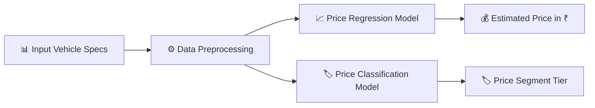

# 🚗 PriceView · Used Car Price Estimation & Market Segmentation

PriceView is a machine learning project that predicts the **resale price of a used car** and classifies it into a **price segment** (*Budget*, *Mid-Range*, or *Luxury*) based on vehicle specs such as age, mileage, engine capacity, and fuel type.

---

## 📌 Project Overview

When buying or selling a used vehicle, determining a fair resale price can be challenging. **PriceView** solves this problem by analyzing historical used car data to train machine learning models.

The project covers three core Machine Learning tasks:
1. **Price Regression**: Predicts the exact selling price of a car in Indian Rupees (₹).
2. **Price Classification**: Classifies cars into price categories (*Budget*, *Mid-Range*, *Luxury*).
3. **Market Clustering**: Groups similar vehicles based on mechanical and physical specs.

---

## 🛠️ How It Works



1. **User Inputs Specs**: Enter vehicle brand, model, age, kilometers driven, fuel type, transmission, mileage, engine CC, max power, and seller type.
2. **Data Preprocessing**: Categorical features are One-Hot Encoded and numerical features are scaled using StandardScaler.
3. **ML Prediction**: Trained models process the inputs to output an estimated resale price and price category tier.

---

## 📊 Dataset & Input Features

The project is trained on the **CarDekho Used Car Dataset** (~15,000 market records).

| Feature | Type | Description | Example |
| :--- | :--- | :--- | :--- |
| `brand` | Categorical | Car manufacturer brand | Maruti, Hyundai, BMW |
| `model` | Categorical | Specific vehicle model | Swift, Creta, City |
| `vehicle_age` | Numerical | Age of vehicle in years | 4 years |
| `km_driven` | Numerical | Total kilometers driven | 35,000 km |
| `fuel_type` | Categorical | Fuel engine type | Petrol, Diesel, CNG |
| `transmission_type` | Categorical | Gearbox mechanism | Manual, Automatic |
| `seller_type` | Categorical | Sales ownership channel | Individual, Dealer |
| `mileage` | Numerical | Fuel efficiency rating | 21.2 km/l |
| `engine` | Numerical | Engine displacement capacity | 1197 CC |
| `max_power` | Numerical | Peak engine output power | 82 BHP |
| `seats` | Numerical | Seating capacity | 5 seats |

---

## 🧠 Machine Learning Models

### 1. Price Regression (Selling Price)
- **Best Model**: **Random Forest Regressor**
- **Accuracy (R² Score)**: `94.2%`
- **Output**: Estimated selling price (e.g. ₹ 5,39,000)

### 2. Price Classification (Segment Tier)
- **Best Model**: **Logistic Regression**
- **Accuracy**: `93.8%`
- **Output**: Budget, Mid-Range, or Luxury Tier

---

## 📁 Project Structure

```text
PriceView/
├── data/
│   └── processed/
│       └── cleaned_data.csv        # Processed market dataset
├── models/
│   ├── regression/                 # Serialized regression model & preprocessor (.pkl)
│   ├── classification/             # Serialized classification model & preprocessor (.pkl)
│   └── clustering/
├── notebooks/                      # Jupyter notebooks for data analysis & training
│   ├── 01_data_understanding.ipynb
│   ├── 02_eda.ipynb
│   ├── 03_preprocessing.ipynb
│   ├── 04_regression.ipynb
│   ├── 05_classification.ipynb
│   └── 07_clustering.ipynb
├── src/
│   └── app.py                      # Streamlit Web Application
├── README.md
└── requirements.txt                # Python dependencies
```

---

## 🚀 Quick Start Guide

### Step 1: Clone the Repository
```bash
git clone https://github.com/Adidam-Akshay-Bhaskar/PriceView.git
cd PriceView
```

### Step 2: Create Virtual Environment & Install Dependencies
```bash
python -m venv .venv

# On Windows:
.venv\Scripts\activate

# On Mac/Linux:
source .venv/bin/activate

pip install -r requirements.txt
```

### Step 3: Run the Streamlit Web Application
```bash
streamlit run src/app.py
```
Open your browser at `http://localhost:8501` to use the application!

---

## ✨ Key Project Takeaways

- **Vehicle Age Impact**: Cars experience the steepest price drop during the first 3 years (~12-15% per year).
- **Engine Power**: Max Power (BHP) and Engine CC have the highest correlation with selling price.
- **Fuel Variant**: Diesel vehicles generally retain higher resale values in mid and luxury segments.

---

## 📄 License
This project is open-source.
